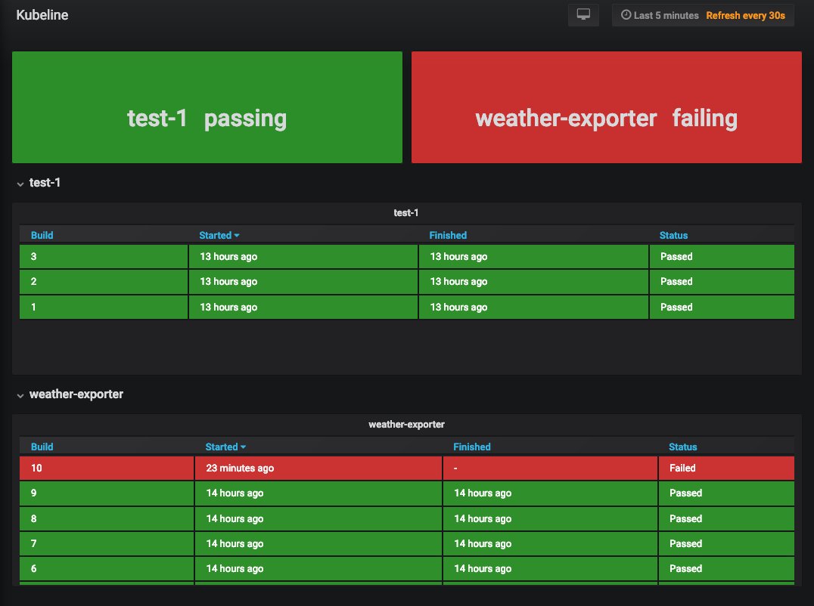

# Kubeline
A Kubernetes native CI tool



## Components
- Custom built scheduler to run jobs
- Utilizes Kubernetes jobs to run builds
- Utilizes Prometheus kube-state-metrics to expose build status metrics
- Utilizes Grafana to vizualize status of pipelines and builds

## Docker credentials
In order for pulls of private Docker repositories and all pushes to occur,
authentication is required in the Docker stages. For this purpose Kubernetes
[image pull secrets][1] are leveraged. Here's how it works:
- an image pull secret with credentials to perform the desired pull/push
  operations must be created in the namespace in which builds are being run
- in the server side config file, a pipeline configuration can contain the name
  of the secret (see below)
- upon running the build, the secret will be mounted to the pod, and attached to
  any docker-build and docker-push stages
- The secret is mounted to docker stages at `~/.docker/config.json`, from the
  file `.dockerconfig.json` in the secret. Therefore the default pattern of
  creating `imagePullSecret` must be followed, otherwise Docker auth won't work

The aforementioned pipeline config containing the secret name:
```
pipelines:
  test-1:
    url: https://github.com/j18e/ci-test-1
    branch: master
    docker_secret: kubeline-docker-test-1
```
Along with this config, the `imagePullSecret` has been created using Kubectl (or
a manifest file):
```
kubectl create secret docker-registry kubeline-docker-test-1 \
    --docker-username=j18e \
    --docker-password=$(cat password-file) \
    --docker-server=https://index.docker.io/v1 # not necessary if authenticating to Docker hub
```

[1]: https://kubernetes.io/docs/tasks/configure-pod-container/pull-image-private-registry/
